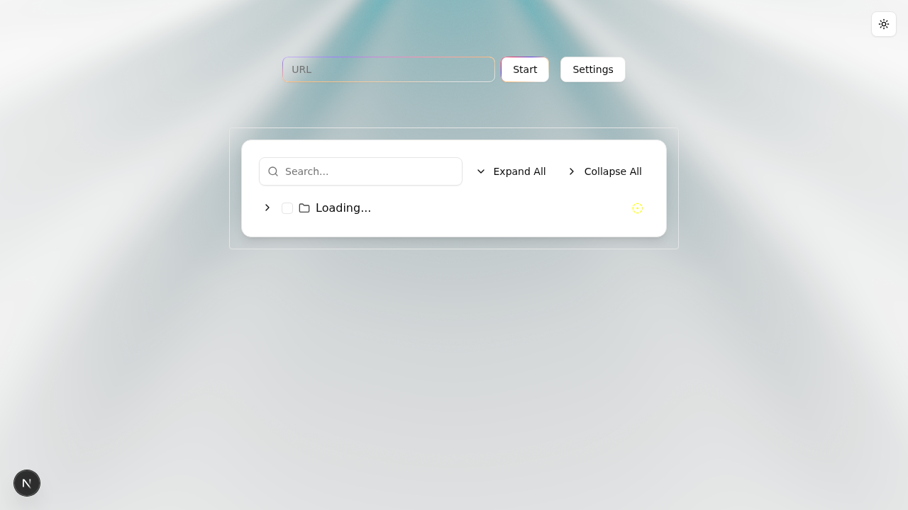
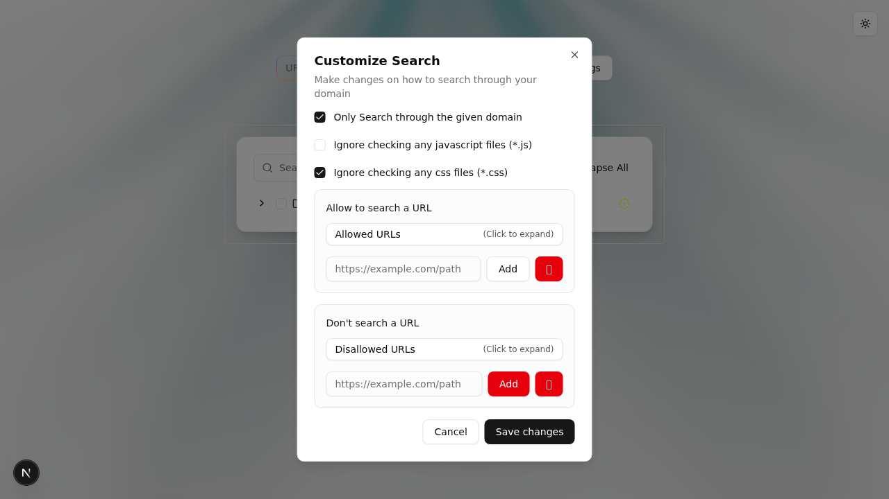

# 🔗 Broler

> **Beautiful web application for finding broken links within websites**

Broler is a powerful, intuitive web application that crawls websites to identify broken links, unreachable resources, and connectivity issues. Built with a modern Go backend and elegant React frontend, it provides comprehensive link analysis with advanced filtering and configuration options.

## ✨ Features

- **🔍 Comprehensive Link Analysis**: Check all URLs on a website to verify their reachability
- **📄 JavaScript & CSS Validation**: Optionally scan JavaScript and CSS files for accessibility
- **🌐 Recursive Site Crawling**: Automatically discover and analyze all linked pages within a domain
- **🎯 Smart Domain Filtering**: Restrict scanning to specific domains or allow cross-domain analysis
- **📋 URL Allow/Block Lists**: Fine-tune scanning with customizable URL inclusion and exclusion rules
- **⚙️ Flexible Configuration**: Toggle JavaScript/CSS file checking and other scanning options
- **🎨 Modern UI**: Clean, responsive interface with real-time progress updates
- **📊 Visual Results**: Tree-view display of discovered links with status indicators
- **🚀 Real-time Updates**: Live progress tracking via gRPC streaming

## 🖥️ Interface

### Main Interface


### Settings Configuration


## 🏗️ Architecture

- **Backend**: Go with gRPC API for high-performance concurrent link checking
- **Frontend**: Next.js with React, TypeScript, and Tailwind CSS
- **Communication**: gRPC streaming for real-time updates
- **UI Components**: Radix UI for accessible, professional components

## 🚀 Quick Start

### Prerequisites

- **Go** 1.24+ 
- **Node.js** 18+
- **npm** or **yarn**

### Installation

1. **Clone the repository**
   ```bash
   git clone https://github.com/Aavtic/broler.git
   cd broler
   ```

2. **Start the backend server**
   ```bash
   go run main.go
   ```
   The gRPC server will start on port `:50051`

3. **Start the frontend** (in a new terminal)
   ```bash
   cd frontend/broler-frontend
   npm install
   npm run dev
   ```
   The web interface will be available at `http://localhost:3000`

### Alternative: Build and Run

1. **Build the backend**
   ```bash
   go build -o broler-server .
   ./broler-server
   ```

2. **Build the frontend**
   ```bash
   cd frontend/broler-frontend
   npm run build
   npm start
   ```

## 📖 Usage

1. **Open the web interface** at `http://localhost:3000`

2. **Enter a URL** to scan in the input field

3. **Configure settings** (optional):
   - **Domain Restriction**: Toggle "Only search through the given domain"
   - **File Type Filtering**: Enable/disable JavaScript and CSS file checking
   - **URL Lists**: Add allowed or disallowed URL patterns

4. **Start the scan** by clicking the "Start" button

5. **View results** in the tree view as they appear in real-time

## ⚙️ Configuration Options

### Domain Settings
- **Only Search Given Domain**: Restricts crawling to the same domain as the initial URL
- **Cross-Domain Crawling**: Allows following links to external domains

### File Type Filtering
- **JavaScript Files**: Toggle scanning of `.js` files
- **CSS Files**: Toggle scanning of `.css` files

### URL Management
- **Allowed URLs**: Whitelist specific URL patterns for priority scanning
- **Disallowed URLs**: Blacklist URL patterns to skip during scanning

## 🔧 Development

### Backend Development

The Go backend uses:
- **gRPC** for API communication
- **HTML parsing** with `golang.org/x/net/html`
- **Concurrent processing** for efficient link checking
- **Custom queue implementation** for URL management

Key components:
- `broler/broler_funcs/`: Core crawling and analysis logic
- `rpc/`: gRPC server and protocol definitions
- `parsing/`: HTML parsing and URL extraction
- `networking/`: HTTP client for link validation

### Frontend Development

The React frontend features:
- **Next.js 15** with Turbopack for fast development
- **TypeScript** for type safety
- **Tailwind CSS** for styling
- **Radix UI** for accessible components
- **Real-time updates** via Server-Sent Events

Key components:
- `app/`: Main application pages and routing
- `components/`: Reusable UI components
- `utils/`: Helper functions and data processing

### API Endpoints

The application uses gRPC with the following main service:

```protobuf
service Broler {
  rpc PageInfo(PagesInfoReq) returns (stream Pages) {}
  rpc ClientRequests(ClientReq) returns (ServerResponse) {}
}
```

## 🛠️ Build Requirements

### Backend Dependencies
```go
require (
    golang.org/x/net v0.42.0
    google.golang.org/grpc v1.74.2
    google.golang.org/protobuf v1.36.6
)
```

### Frontend Dependencies
- Next.js 15.4.5
- React 19.1.0
- TypeScript 5+
- Tailwind CSS 4
- Radix UI components

## 📊 Performance

- **Concurrent Processing**: Multiple goroutines for parallel link checking
- **Intelligent Caching**: Avoid redundant requests to the same URLs
- **Streaming Results**: Real-time updates without waiting for complete scan
- **Memory Efficient**: Tree-based data structure for large site maps

## 🤝 Contributing

We welcome contributions! Here's how to get started:

1. **Fork the repository**
2. **Create a feature branch**: `git checkout -b feature/amazing-feature`
3. **Make your changes** and add tests if applicable
4. **Commit your changes**: `git commit -m 'Add amazing feature'`
5. **Push to the branch**: `git push origin feature/amazing-feature`
6. **Open a Pull Request**

### Development Guidelines

- Follow Go formatting standards (`gofmt`)
- Use TypeScript for frontend development
- Add appropriate error handling
- Include tests for new functionality
- Update documentation for significant changes

## 📝 License

This project is licensed under the MIT License - see the [LICENSE](LICENSE) file for details.

## 🙏 Acknowledgments

- Built with [Go](https://golang.org/) and [Next.js](https://nextjs.org/)
- UI components from [Radix UI](https://www.radix-ui.com/)
- Styling with [Tailwind CSS](https://tailwindcss.com/)
- Icons from [Lucide React](https://lucide.dev/)

## 📞 Support

If you encounter any issues or have questions:

1. Check the [Issues](https://github.com/Aavtic/broler/issues) page for existing problems
2. Create a new issue with detailed information about your problem
3. Include system information, error messages, and steps to reproduce

---

<div align="center">
  <strong>Happy Link Checking! 🔗✨</strong>
</div>
